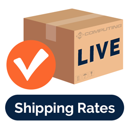

# Live Rates for ShipStation by IQComputing

Live Rates for ShipStation is a free Open Source plugin that works with [ShipStation](https://www.shipstation.com/) and [WooCommerce](https://woocommerce.com/) to pull in shipping estimates from the most common shipping providers.

**ShipStation** is a 3rd party provider helping WooCommerce store owners compare shipping carrier rates, automate shipping processes, print labels, sync order data, and group tracking information, among other features.

This plugin connects to the ShipStation API using an authentication key to display shipping rates from various common carriers supported by ShipStation. This allows store owners to group all their shipping carriers under one umbrella which makes management easier and allows customers to choose the best shipping method for them which leads to happier customers.

In order to use the Live Rates for ShipStation plugin, you must have a [premium ShipStation account](https://www.shipstation.com/pricing/), and purchased the [ShipStation for WooCommerce](https://woocommerce.com/products/shipstation-integration/) plugin. This plugin **will not work** without access to the ShipStation API which is tied to your premium ShipStation account.

Please review [ShipStations Terms of Service](https://www.shipstation.com/terms-of-service/) and [ShipStations Privacy Policy](https://auctane.com/legal/privacy-policy/) for more information about how your data is managed.

## Requirements

Live Rates for ShipStation is free to use, but it does require a premium ShipStation account to access their REST API. In addition, there are plugin requirements as well. Here's a list of requirements in order to use this plugin properly:

1. [A Premium ShipStation Account](https://www.shipstation.com/pricing/) (Gold+)
1. [WooCommerce Plugin](https://wordpress.org/plugins/woocommerce/)
1. [ShipStation for WooCommerce Plugin](https://woocommerce.com/products/shipstation-integration/)
1. [Live Rates for ShipStation Plugin](https://wordpress.org/plugins/live-rates-for-shipstation/)

Once you have the above set, you will need to make sure that your ShipStation Plugin is connected to your ShipStation account. We recommend following the [ShipStation documentation](https://woocommerce.com/document/shipstation-for-woocommerce/#setup-and-configuration) regarding their integration wizard.

## Installation and Setup

1. Navigate to WooCommerce > Settings > Integration > ShipStation and enter your ShipStation REST V2 API Key. Please refer to their documentation to [Access the ShipStation API](https://help.shipstation.com/hc/en-us/articles/360025856212-ShipStation-API).
1. Once the API Key has been entered and verified, you may select which carriers you would like to support using the Shipping Carriers select box.
1. Once you have your carriers selected you can navigate to WooCommerce > Settings > Shipping to setup your Shipping Zones.
1. Select a zone and click the Add Shipping Method button at the bottom to add "ShipStation Live Rates".
1. From here you can setup custom boxes and select which services from the previously selected carriers you would like to make available for the selected shipping zone.

For more information, please review our support article [Live Rates for ShipStation](https://www.iqcomputing.com/support/articles/live-rates-for-shipstation/).

## Support

This is a free plugin entirely volunteer run. While we will ensure that the plugin is up-to-date for any security issues or breakfixes, we cannot commit to supporting any customizations to the plugin or feature requests, but welcome these questions and requests through the [WordPress Support Forums](https://wordpress.org/support/plugin/live-rates-for-shipstation/) for our team to consider in a future release of the plugin. We recommend using the WordPress Forums for all inquiries.